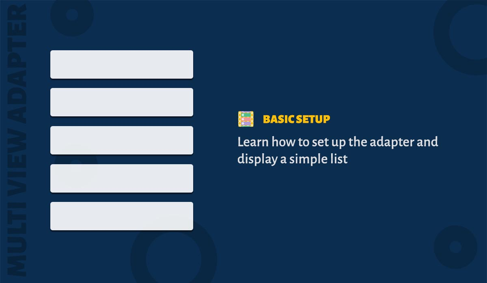

Lets create a basic adapter which displays a list of cars.

First, you need to create an ItemBinder for your model. ItemBinder is reponsible for creating and binding your view holders. Following is the code snippet of ItemBinder for CarModel class.

### CarBinder

```java
public class CarBinder extends ItemBinder<CarModel, CarBinder.CarViewHolder> {

  @Override public CarViewHolder createViewHolder(ViewGroup parent) {
      return new CarViewHolder(inflate(R.layout.item_car, parent));
  }

  @Override public boolean canBindData(Object item) {
      return item instanceof CarModel;
  }

  @Override public void bindViewHolder(CarViewHolder holder, CarModel item) {
      holder.tvCarName.setText(item.getName());
  }

  static class CarViewHolder extends ItemViewHolder<CarModel> {

    TextView tvCarName;

    public CarViewHolder(View itemView) {
        super(itemView);
        tvCarName = findViewById(R.id.tv_car_name);
    }
  }
}
```

> Note the ```canBindData(object)``` method. This method is used to identify whether the model belong to this ItemBinder.

Now register the ItemBinder created above to the adapter. Since we are displaying a list of items we need to create an ListSection object and add the data items to it. Add this section to the adapter. Done.

### Inside Activity/Fragment

```java
class CarListActivity extends Activity {

  private RecyclerView recyclerView;
  private List<CarModel> cars;

  public void initViews() {

      // Create Adapter
      MultiViewAdapter adapter = new MultiViewAdapter();

      // Register Binder
      adapter.registerBinders(new CarItemBinder());

      // Create Section and add items
      ListSection<YourModel> listSection = new ListSection<>();
      listSection.addAll(cars);

      // Add Section to the adapter
      adapter.addSection(listSection);

      // Now set the adapter to the recyclerview
      recyclerView.setAdapter(adapter);
  }
}
```

Inside a single adapter you can register multiple ```ItemBinders``` and add multiple ```Sections```